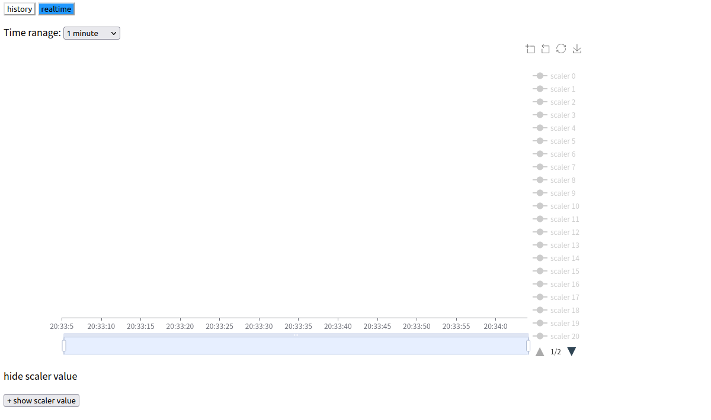

# 进阶使用

## 两步配置

除了[快速开始](quick-start.md#使用)所提到的一步到位的配置方式，还可以选择两步配置的方式。实际上在配置过程中，程序会将配置文件中的表达式转化成直接写 FPGA 内存的低级配置文件，该低级配置文件和 FPGA 内部的设置息息相关，适合有经验的人进一步调试使用。一般的两步方式如下

```bash
# 从高级配置文件产生低级配置文件
$ ./convert example_logic_0.txt example_memory_0.txt
# 读取配置文件配置 FPGA
$ ./config example_memory_0.txt
```

即先根据包含逻辑表达式的高级配置文件产生中间的低级配置文件，随后依然运行 `config` 程序配置 FPGA 芯片，此时省略 `-l` 参数。

同时，考虑到 `easy-config-logic` 项目编译时间不短，在 zynq7020 的系统内可以考虑使用另一个项目[easy-config-logic-c](https://github.com/kinstaky/easy-config-logic-c)，该项目只能使用低级配置文件进行配置，所以需要在另一台机器中产生低级配置文件后再复制到 zynq7020 的系统中。


## 定标器

所谓定标器（scaler），即统计信号频率的模块。在配置文件中写好定标器定义后，FPGA 配置好后会将被检测信号的频率记录在内存中。

### 太长不看版

#### 命令行界面显示

在 zynq 的系统中运行程序即可读取

```bash
$ ./scaler_server -p
```

如此，程序将在屏幕中打印所有定标器记录的信号频率，单位 Hz，该值每秒刷新一次。如果定标器未定义，则会显示频率为 0Hz。按 Ctrl+C 退出程序。

#### 网页图形界面显示

在 zynq 的系统中运行

```bash
$ ./scaler_server port
```

在 pc 中运行

```bash
$ ./scaler_client zynq_ip port
```

以上命令中，port 是一致的端口，zynq_ip 是 MZTIO 中系统的 ip。

然后 pc 的浏览器打开 `standalone/scaler/scaler-visual.html`，可以使用如下命令用 firefox 打开

```bash
$ firefox standalone/scaler/scaler-visual.html
```

然后在浏览器中查看。


### 记录数据

考虑到可能需要将定标器的值记录在文件中供后续处理，本项目另外提供了两个程序以记录定标器内容。因为考虑到 MZTIO 中搭载的嵌入机性能较差，存储空间小，所以我觉得其作为服务器发送定标器数据到另一台电脑中存储和查看更加适合。因此，两个程序一个是在 MZTIO 中的系统中运行的服务端程序 `scaler_server`，另一个是在在线电脑中运行的客户端程序 `scaler_client`。

第一个程序是 `scaler_server`，它运行在 MZTIO 的系统中

```bash
$ ./scaler_server -h
Usage: ./scaler_server [options] [port] [log file] [log level]
Options:
  -h           Print help and exit.
  -v           Print version and exit.
  -p           Print on screen.
  port         Set the listening port, necessary for server.
  log file     Set the log file path, do not log if not set.
  log level    Set the log level: error, warning, info, debug, default is warning.
```

该程序主要由两种用法，一是只显示定标器的数值，即前面提到的 `./scaler_server -p`；二是作为服务端等待客户端的数据请求。如果只是简单的启动服务器，直接 `./scaler_server xxxx`，将 xxxx 替换为合适的端口。更多的参数如下

+ `-h` 打印帮助信息
+ `-v` 打印版本信息
+ `-p` 在屏幕上实时显示定标器的值

+ `port` 服务端的监听端口，设置后就会开启服务器，不设置就必须设置 `-p` 以显示实时定标器数值
+ `log file` 日志文件的路径，不设置时不记录日志
+ `log level` 日志记录内容，error 只记录错误信息，warning 记录错误和警告信息，如此类推，默认值 warning
+ 

第二个程序是客户端程序，可以在 zynq7020 的系统中运行，但更推荐在正经的 pc 中运行，运行方法

```bash
$ ./scaler_client -h
Usage: ./bin/scaler_client [options] host port [data path] [log file] [log level]
Options:
  -h           Print this help and exit.
  -v           Print version and exit.
  -t           Record scaler values in text(in binary default).
  -p           Print scaler value on screen.
  -s           Run http server for visual scaler values.
  host         Set the host to connect to, necessary.
  port         Set the port to connect to, necessary.
  data path    Set the path to record data and time, default is this directory(.).
  log file     Set the log file path, do not log if not set.
  log level    Set the log level: error, warning, info or debug, default is warning.
```

该程序将向服务端程序请求定标器记录的数据，并保存在文件中，输入入Ctrl+C 退出程序。

+ `-h` 打印帮助信息
+ `-v`打印版本信息
+ `-t` 将数据保存为可阅读的文本格式，默认为二进制格式
+ `-p` 请求数据同时在屏幕中显示实时的定标器数值，和 `scaler_server -p` 表面上一样
+ `-s` 同时启动一个 http 服务器以提供图形化的监视界面
+ `host` 服务端的地址，必须设置
+ `port` 服务端监听端口，必须设置，与服务端设置的保持一致
+ `data path` 数据文件路径，默认为程序运行目录，记录的数据将以天为单位划分，即一天一个文件，比如2022年6月1日记录的数据将保存在 20220601.txt 或 20220601.bin 中
+ `log file` 日志文件的路径，不设置时不记录日志
+ `log level` 日志记录内容，error 只记录错误信息，warning 记录错误和警告信息，如此类推，默认值 warning


### 查看数据

一般来说，我喜欢把数据存成二进制的，占用空间小，读写速度快，非顺序读写，缺点是人类看不懂。所以我又写了 1 个花里胡哨的程序来查看数据。

第一个是用`html` 和  `javascript` 写的，用浏览器打开 `visual-scaler.html` 即可，比如说

```bash
$ firefox standalone/scaler/scaler-visual.html
```

但在打开前，确保 `scaler_client` 使用了 `-s` 选项，否则接收不到数据（重启 `scaler_client` 后记得刷新页面）。打开浏览器即可看到如下界面。



界面最上方是选择查看的方式，历史模式 **history** 或者实时模式 **realtime**。按钮变成蓝色表示被选中，如上图就是实时模式。

#### 实时模式

实时模式用于实时监控定标器的数据，点击 **realtime** 按钮后，就会得到上面的界面。

模式选择下方是观察时间范围选择，可以选择图里显示的时间范围，包括1分钟、20分钟、1小时、10小时和1天。选择后图显示的范围也会相应变化。加载完成后点击图右边栏的图例，即可查看指定定标器的数据。简单来说，这里粗略地模仿了下载或上传文件的实时下载、上传网速显示。

图表下方的按钮用于实时显示数值的定标器数值，类似于[命令行界面显示](#命令行界面显示)，就是显示一堆跳动的数据。按钮内文本是 **+ show scaler value** 点击会显示实时数据，再点击会隐藏实时数据。


#### 历史模式

历史模式用于查看过去几天的数据，点击 **history** 后得到如上图的界面。可以看到模式选择下方是日期选择，有两个日期需要设置，开始日期和结束日期，查看的是从（含）开始日期到（含）结束日期之间的定标器数据，选择日期后点击按钮 **request**，请求数据，稍等片刻就会加载完成。同样的，载入数据后需要点击图右边的图例来显示特定定标器的数据。简单来说，这里粗略地模仿了订酒店 app 的交互方式，选日期，看数据。

