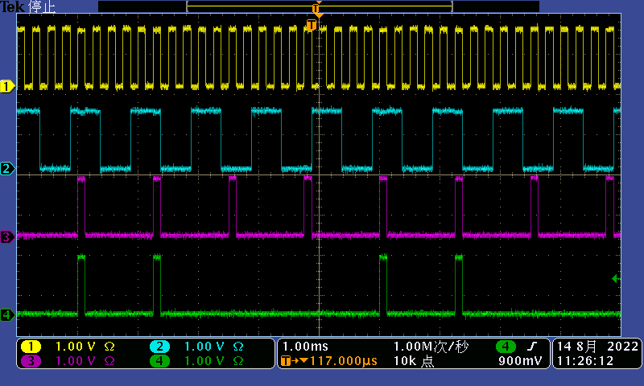

# 配置示例

## 测试仪器

+ 示波器：Tektronix DPO3034 300MHz
+ MZTIO：子板安装在最下面，即对应 C 组网口

## 示例1

### 硬件设置

将 MZTIO 子板上面两个 LEMO 口（对应 C17 和 C18）设置为输入，剩余的6个 LEMO 都设置为输出。

使用 LEMO 线将第1个 LEMO 口和第5个 LEMO 口连接，将第2个 LEMO 口和第6个 LEMO 口连接。如此，C17 接收 C25 的输出，C18 接收 C26 的输出。

使用 LEMO 线将剩余的 LEMO 口从上到下连接到示波器的通道1、2、3、4。如此，C21 连接通道1，C22 连接通道2，C29 连接通道3，C30 连接通道4。

### 配置文件

`examples/example_logic_0.txt` 如下

```python
D0 = C17 / 5
C21 = C17
C22 = C18
D29 = D0 & C17
C30 = D0 & C18

C25 = clock_4kHz
C26 = clock_1kHz

S0 = C17
S1 = C18
S2 = C29
S3 = C30
S4 = D0
```

在 MZTIO 系统中运行

```bash
./config -l example_logic_0.txt
```


### 设置说明

经过上述两步配置

+  示波器通道1监视第3个 LEMO 口的信号，第3个 LEMO 口输出的是第1个 LEMO 口接收到的信号（`C21 = C17`），而第1个 LEMO 口接收第5个 LEMO 口输出的4kHz 的方波信号（`C25 = clock_4kHz`）。因此，在示波器通道1应该看到4kHz 的方波信号
+ 示波器通道2监视第4个 LEMO 口的信号，第4个 LEMO 口输出的是第2个 LEMO 口接收到的信号（`C22 = C18`），而第2个 LEMO 口接收第6个 LEMO 口输出的1kHz 的方波信号（`C26 = clock_1kHz`）。因此在示波器通道2应该看到1kHz 的方波信号
+ 示波器通道3监视第7个 LEMO 口的信号，第7个 LEMO 口输出的是第1个分除结果和第1个 LEMO 口接收到的信号的与（`C29 = D0 & C17`），而第1个分除结果是第1个 LEMO 口的输入分除5倍的结果（`D0 = C17 / 5`）。分除5倍，即每来5个信号才允许1个信号出现，其他信号都变成零电平，分除前后的信号的与就会得到分除后的信号。因此，在示波器通道3应该看到800Hz 的信号，并且信号的门宽和通道1的信号一样，即 125${\rm \mu s}$。
+ 示波器通道4监视第8个 LEMO 口的信号，第8个 LEMO 口输出的是第1个分除结果和第2个 LEMO 口接收到的信号的与（`C30 = D0 & C18`）。已知示波器通道3显示的就是第1个分除结果。因此，在示波器通道4看到的应该是通道2和通道3的与。


### 示波器结果




+ 通道1显示的是方波信号，且1格1ms 内为4个周期，是4kHz的方波
+ 通道2显示的也是方波信号，1格1ms 刚好1个周期，是1kHz的方波
+ 通道3显示的信号在5格5ms 内有4个周期，即为800Hz 的信号，且信号宽度与通道1一样
+ 通道4显示的信号时通道2和通道3的与


### 利用内置定标器检查

输入命令查看内置定标器计数

```bash
./scaler
scalar      counts
 0           4000
 1           1000
 2            800
 3            600
 4            800
 5              1
 6              1
 7              1
 8              1
 9              1
10              1
11              1
12              1
13              1
14              1
15              1
16              1
17              1
18              1
19              1
20              1
21              1
22              1
23              1
24              1
25              1
26              1
27              1
28              1
29              1
30              1
31              1
```

从定标器结果来看，除了第4个定标器以外都是意料之中的结果，而第4个定标器监视的信号 C30，即示波器中看到的通道4信号，理论上应该是400Hz。实际上细看上图，可以发现示波器的触发时通道4，且触发的信号在屏幕中间部分。这意味着在屏幕中间部分有一个因为宽度过窄而看不见的信号，前面提到通道4的信号时通道2和通道3的信号的与结果，那么如果在屏幕中间部分，通道2的信号变为1的瞬间通道3的信号还没有变为0，那么即有可能产生一个宽度极窄的通道4信号。下图展示了这个窄信号在被看见的情形


因此内置定标器显示的通道4有600Hz 是可以接受的。实际测量情况中一般不会出现如此有规律的波形，并且符合的信号也不会像通道2和通道3的信号一样周期性地产生窄信号，所以在实际情况中应该不会出现这样与直观不符的情形。


### 小结

本示例展示了

+ 如何定义并使用分除
+ 如何定义与符合
+ 如何定义时钟（方波信号）输出

并利用示波器和内置定标器检查了结果。
